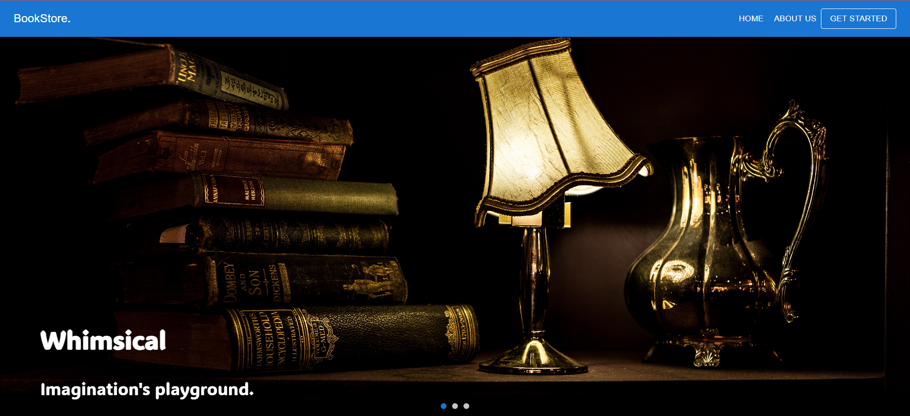
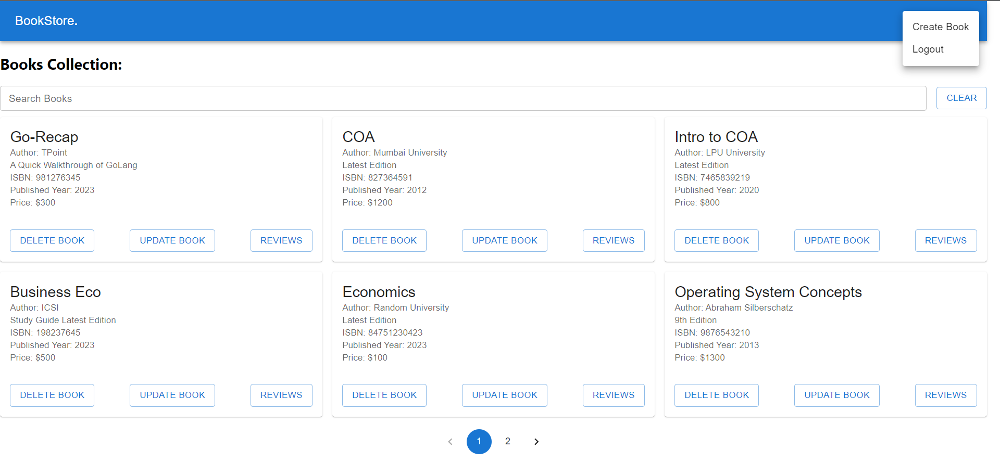
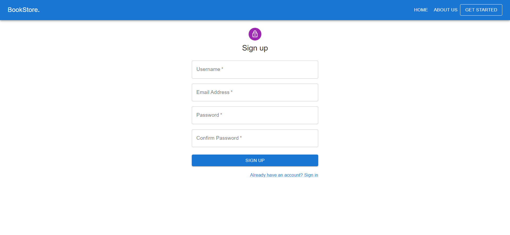
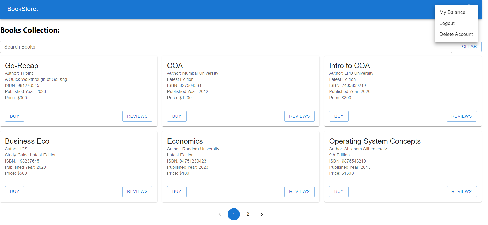

[](https://classroom.github.com/a/LECuYE4o)


# Bookstore.

A robust online bookstore, it is a full-stack web application with a Go backend and a React frontend. It includes user authentication, book management, and reviews, providing a seamless and interactive book shopping experience.


## Requirements

- go (version: 1.21.0)
- node (version: v18.12.1)
- npm (version: 8.19.2)
- PostgreSQL (latest version)


## Run Locally

Before you get started, please ensure that you have above mentioned requirements installed.

Clone the project

```bash
  > git clone https://github.com/BalkanID-University/vit-2025-summer-engineering-internship-task-srivenkatharsha.git
```

Go to the project directory

```bash
  > cd vit-2025-summer-engineering-internship-task-srivenkatharsha/
```

Install backend (go) dependencies

```bash
  > go get .
  > go mod tidy
```

Install frontend (react) dependencies

```bash
  > cd frontend/bookstore-app
  > npm i
```

Modify the backend .env file in the root directory. (Note: modify the existing values in .env and set the correct values)

```bash
    APP_PORT = 8080
    DB_USERNAME = postgres
    DB_PASSWORD = 123
    DB_NAME = bookstoredb
    DB_HOST = localhost
    DB_PORT = 5432
    DB_TIME_ZONE = Asia/Kolkata
    SESSION_SECRET_KEY = your-secret-key
    LOG_FILENAME = app.log
    LOG_FILE_MAXSIZE = 10
    LOG_FILE_MAXBACKUPS = 3
    LOG_FILE_MAXAGE = 7
    REACT_APP_FRONTEND = http://localhost:5173
```

Navigate to the `frontend/bookstore` directory and open the .env file for editing. Ensure that the APP_PORT variable is set to the correct value, representing the backend's port.

```bash
    VITE_REACT_APP_BACKEND_URL=http://localhost:{APP_PORT}
```
**Note:** Make sure that you have configured the `.env` files properly.

For running the backend server (from the root directory of the project)

```bash
  > go run .
```

For running the react application (from the root directory of the project) 

dev mode:
```bash
  > cd frontend/bookstore-app
  > npm run dev 
```
build mode:
```bash
  > cd frontend/bookstore-app
  > npm run build 
```


## Backend API Reference

#### User Registration

```http
POST /api/auth/register
```
example json body for user registration:
```json
{
    "username": "example_user",
    "email": "user@example.com",
    "password": "your_password"
}

```

#### User Login

```http
POST /api/auth/login
```
example json body for user registration:
```json
{
  "email": "user@example.com",
  "password": "your_password"
}
```

#### User Logout

```http
GET /api/auth/logout
```
#### User Account Deletion
```http
DELETE /api/auth/delete-account
```
example json body for user account deletion:
```json
{
  "email": "user@example.com",
  "password": "your_password"
}
```

#### Create Book (can be performed by admin user only)

```http
POST /api/books/create-book
```
example json body for creating the book:
```json
{
  "Title": "Book Title",
  "Author": "Author Name",
  "Description": "Book Description",
  "ISBN": "1234567890",
  "PublishedYear": 2023,
  "Price": 19.99,
  "DownloadLink": "https://example.com/book-download"
}
```

#### Update Book (can be performed by admin user only)

```http
PUT /api/books/:isbn
```
example json body for updating the book:
```json
{
  "Title": "Book Title",
  "Author": "Author Name",
  "Description": "Book Description",
  "ISBN": "1234567890",
  "PublishedYear": 2023,
  "Price": 19.99,
  "DownloadLink": "https://example.com/book-download"
}
```
#### Deleting Book (can be performed by admin user only)

```http
DELETE /api/books/:isbn
```

#### Getting the books

```http
DELETE /api/books/:isbn
```
#### Getting the book detail

```http
GET /api/books/:id
```

#### Getting all the reviews for the book

```http
GET /api/getReview/:isbn
```
#### Posting the review for a book

```http
POST /api/post-review/:isbn
```

example json body for updating the book (rating 1-5):
```json
{
  "rating": 5,
  "comment": "Nice!"
}
```
#### Buying the book:

```http
GET /api/buy-book/:isbn
```

#### Getting the user-balance:
```http
GET /api/buy-book/:isbn
```

#### Check Book Ownership Status:
```http
GET /api/ownershipStatus/:isbn
```

#### Getting the download link:
```http
GET /api/getDownloadLink/:isbn
```


# App's images:
#### Homepage: 

#### Admin's Dashboard: 

#### Authorization Page:

#### User's Dashboard:


## Tech Stack (high-level) 

**Client:** React, Material UI, react router.

**Server:** Go, gorilla sessions, gin, logrus, lumberjack, bcrypt, gorm.

**Database**: postgresql